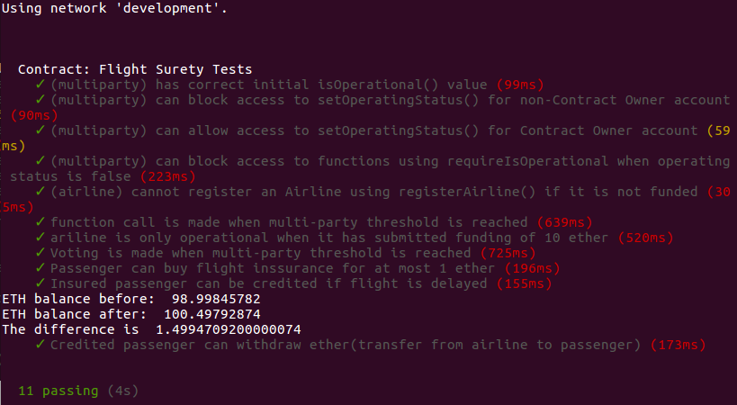
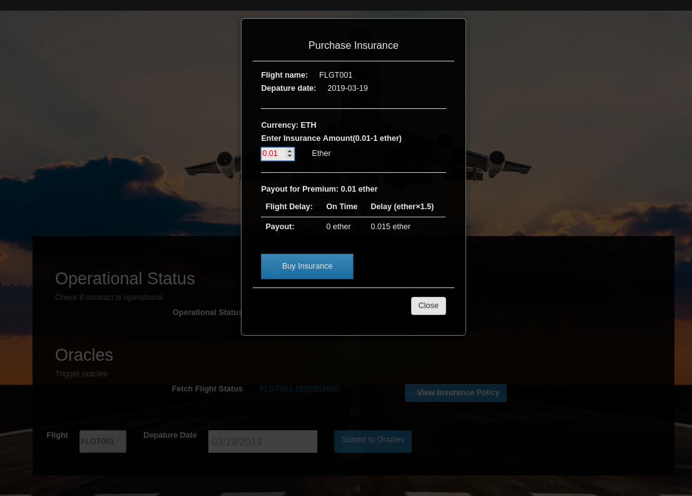
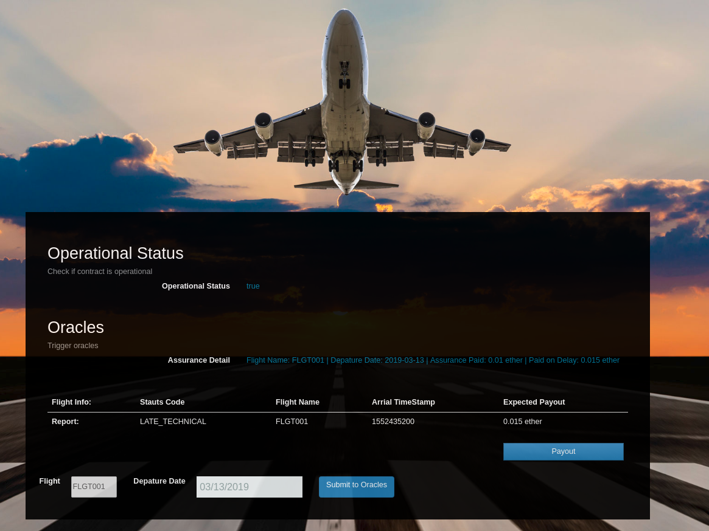
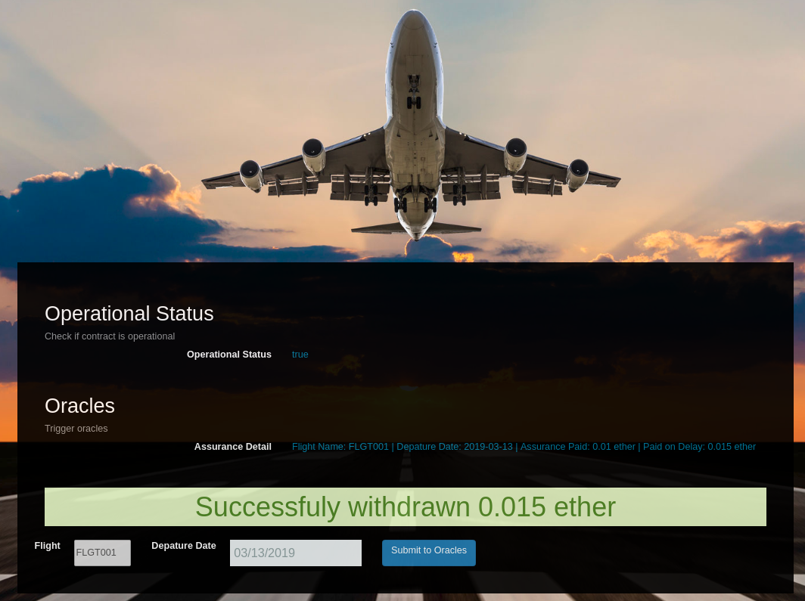
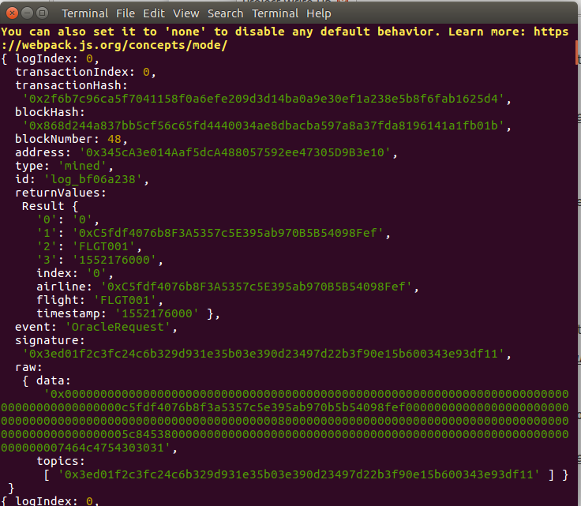
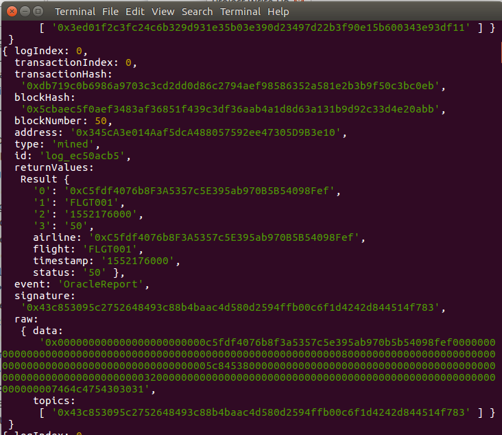
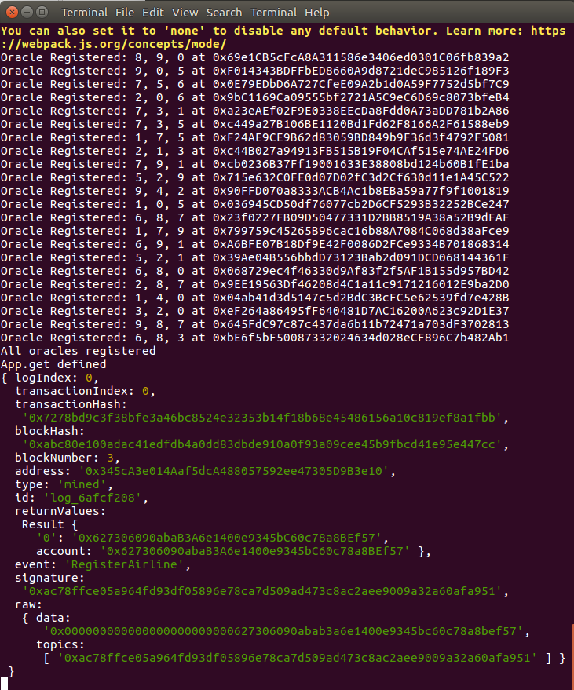

# FlightSurety Project Writeup
<hr>

FlightSurety is a sample application project for Udacity's Blockchain course.

## Setting Up the Project:

This project folder contains the Smart Contract code in Solidity (using Truffle), test (also using Truffle), dApp scaffolding (using HTML, CSS, JS) and server app scaffolding.

To setup the project we require you have the following pre installed:

* Truffle version 5.0.2
* Solidity version 0.4.25
* nodejs version 10.12.0
* npm version 6.4.1
* Ganache v1.2.3


### Install

To install all necessary dependencies, run:

`npm install` from the root folder of this project.

To be sure your environment is properly setup, follow the instructions outlined in the `setup.txt` file.


To build the project, run:

`truffle compile`.

#### Deploy Client

To run truffle tests:

`truffle test ./test/flightSurety.js`



**Fig1**

`truffle test ./test/oracles.js` 

*NB:*

- *Make sure about 35 accounts are setup in Ganache before running this test.*
- *Make sure you start the server first and wait some few minutes/seconds for the server to register all the oracles.*

To use the dapp, run:

`truffle migrate` 

`npm run dapp`

To view dapp run the following on your browser:

`http://localhost:8000`

#### Deploy Server

On a seperate terminal, run

`npm run server` 


#### Display of Dapp


**Fig2**

## How to build the project
For a successful build, please follow the following steps
- Install packages with `npm install`
- Build project with `truffle compile`
- start ganache and make sure it has up to 35 accounts. Also check `truffle.js` for other configurations like mnemonic, gas, port. Make sure there are well set up in ganache.
- migrate with `truffle migrate`
- start server with `npm run server` and wait few minutes till it has registered all the oracles
- On a separate terminal, start the dapp with `npm run dapp`


## How to use the Dapp
For a successfull transaction, follow the following steps

- Select flight and depature time, then submit oracle request
- View insurance policy
- On the popup, enter the insurance amount(Take note not to type in the amount, but use the input field arrows to select a value)  and click `Buy Insurance` to buy insurance, then close the popup
- Track your flight status. This will tell you if your flight has been delayed or not
- Withdraw if flight was delayed by clicking on `Payout`. A successful message is displayed if withdrawn was successful.


## Project workthrough
Here, I will work you through how I addressed all the rubrics

### Separation of Concerns, Operational Control and “Fail Fast”
#### Smart Contract Seperation
To addressed this rubric, I separated the contracts in to data persistence and (logic and oracles code)  in the files below:

- FlightSuretyData.sol 
- FlightSuretyApp.sol 

The `FlightSuretyData.sol` file handles all the Data manipulations and variables creation while the `FlightSuretyApp.sol` handles the logic that governs the app. I used the knowledge of interface to accomplish this rubric where we made an interface of the FlightSuretyData in the FlightSuretyApp calling the following functions from `FlightSuretyData.sol` into `FlightSuretyApp.sol`: 

```
// Creating an interface to FlightSuretyData.sol
contract FlightSuretyData{
    function _registerAirline(address account, bool isOperational) external;
    function multiCallsLength() external returns(uint);
    function getAirlineOperatingStatus(address account) external returns(bool);
    function setAirlineOperatingStatus(address account, bool status) external;
    function registerInsurance(address airline, address passenger, uint256 amount) external;
    function creditInsurees(address airline, address passenger, uint256 amount) external;
    function getInsuredPassenger_amount(address airline) external returns(address, uint256);
    function getPassengerCredit(address passenger) external returns(uint256);
    function getAirlineRegistrationStatus(address account) external  returns(bool);
    function fundAirline(address airline, uint256 amount) external;
    function getAirlineFunding(address airline) external returns(uint256);
    function withdraw(address passenger) external returns(uint256);
    function getVoteCounter(address account) external  returns(uint);
    function setVoteCounter(address account, uint vote) external;
    function getVoterStatus(address voter) external returns(bool);
    function addVoterCounter(address airline, uint count) external;
    function resetVoteCounter(address account) external;
    function addVoters(address voter) external;
     
}    
```


#### Dapp Created and Used for Contract Calls
The Dapp client was gotten from this [repo](https://github.com/techbubble/flightsurety) and the following operations were implemented for this rubric

##### Passenger can purchase insurance for flight

The passenger uses the Dapp to purchase insurance for flight. The contract requires up to 1 ether for insurance purchase. The request is intercepted by the FlightSuretyApp with the function `buy()` which stores the ether to airline balance, then calls the corresponding `buy()` from FlightSuretyData to save the transaction.



**Fig3**

##### Trigger contract to request flight status update

The contract can be triggered to request flight status update


### Oracle Server Application

#### Operational status control is implemented in contracts
Operational status is implemented in the `FlightSuretyData.sol` contract file and it is handeled in the functions
- isOperational - check operational mode (i.e if true or false)
- setOperationalStatus - set operational mode to true or false by airlines with operation status set to true.
- setAirlineOperational - allow airlines to set operational status

*NB: Only registered airlines can set operational status.*

#### Fail Fast Contract
The fails fast contract was implemented using the `require` method at the beginning of most functions, to perfrom relevant checks to see if the given condition is met before it is executed.

### Airlines

#### Airline Contract Initialization

When the `FlightSuretyApp` contract is deployed, the account used to deploy the contract which is usually the first account in ganache, is registered as the first airline. This ability was implemented in the constructor of the `FlightSuretyApp.sol` code. 


#### Multiparty Consensus

After the last review, I had to do something different here. This is what I did:

I defined a constant `M` which is the number of private keys required for transactions. In the `FlightSuretyData.sol`, we have an array `multiCalls` which holds each registered airlines and their operational status. In the beginning, we have just the owner of the contract which is registered and is made operational. For each other registration, I first check if the length of multiCalls has reached M. If not, we do a normal registration with their operational status to false. But if it has reached M, I now do a multiparty consensus.

Basically, my registration function returns two booleans representing (registration_sucess, voting status) respectively. For the first case when the constant has not yet been reached, it returns `(true, false)` indicating that airline has been registered without requiring a vote. If the constant has been reached and no voting has been done yet, it returns `(false, false)` indicating that the airline has not been registered and requires a vote. In this case, the voting will take place via the function `approveAirlineRegistration()`. This function takes the airline we are voting for plus a boolean indicating if he is been voted in or out. after the voting has been done, a record of the voting is stored in the contract. When next that same airline is registered, and the constant has been reached, the contract checks if a voting was previously done for that airline, if yes, it gets the vote count and if it is greater than or equal to half the number of registered airlines, then the airline is registered and returns `(true, true)` indicating that the airline was registered via a vote. If not, then the airline is not registered and returns `(false, true)` indicating that the airline was not registered via a vote.


#### Airline Ante

Here, I considered that an airline will only be allowed to accept payment of insurance from a passenger only if the airline has submitted a funding of 10 ether. This funding is stored in the contract and later used to payout passengers in case of delay. When an airlines pays funding, it is then made operational by setting its operational status flag to true.


### Passengers

#### Passenger Airline Choice

A fix list was created in the file `src/server/server.js` to enable the passenger select flights.


#### Passenger Payment
A model was included in the Dapp which helps the passenger view insurance policy and make payment. Check **Fig3**

#### Passenger Repayment

If flight is delayed due to airline fault, passenger receives credit of 1.5X the amount they paid. This amount is not directly send to the passenger wallet. It is stored in the contract. It is also important to note that, repayment is only possible for flight status codes 20 and 40.(ie  flight was delayed due to airlines(inlcuding technical)).


#### Passenger Withdraw
For a passenger to be able to withdraw. He must have received credit dure to flight delayed. The funds are then transfered directly to the passenger wallet. This is acheived by clicking on the button `payout`



**Fig4**

Below shows a successful withdraw of `0.015(0.01 * 1.5) ether`



**Fig5** 

#### Insurance Payouts

Insurance payouts are not sent directly to passenger’s wallet. It is stored in the contract. It is only sent to the passenger's wallet during withdraw.


### Oracles (Server App)

#### Functioning Oracle
In the `server.js` we added the functionalities of the Oracle. 
- OracleRequest: This event is fired when flight status request is submitted. 



**Fig6**

- OracleReport: This event is fired when a response is submitted. Oracles track the flight status request and if they have a matching index, it fetch data and submit a response



**Fig7**

#### Oracle Initialization
Up to 22 oracles are registers when the app is deployed (thus you must ensure that ganache has well enough accounts available). Each oracle is regisered with a fee of 1 ether.



**Fig8**

* Also, you can check ganache and see the various accounts(from account index 11) that were registered as oracle.

#### Oracle Updates

When the Submit Request button is clicked, an OracleRequest event is emitted by the Smart Contract and captured by the server and displayed on the console used to launch the server. I also was able to capture the index of the oracle used to send the request.

#### Oracle Functionality

When the Track Flight status button is clicked, The index of the oracle needed to respond is received from the previous request and then the server will loop through all registered oracles, identify those oracles for which the OracleRequest event applies, and respond by calling into FlightSuretyApp contract with random status code of Unknown (0), On Time (10) or Late Airline (20), Late Weather (30), Late Technical (40), or Late Other (50)


## IMPORTANT NOTES!!!
- Each time you wish to build the project, ensure that you delete the existing build folder first.
- Make sure each migration, you first restart ganache.
- Ensure that ganache has well enough accounts available. About 34 to be precise.
- In the section to buy insurance. make sure you don't type in the insurance amount. Use the arrows that will appear in the input interface to select an amount.
- For easy understanding of the process, you can always check the server terminal as it will always
print events as it happens. Also you can check the browser console.

## Resources
- http://www.dappuniversity.com/articles/the-ultimate-ethereum-dapp-tutorial
- https://hackernoon.com/a-note-on-numbers-in-ethereum-and-javascript-3e6ac3b2fad9
- https://www.bitdegree.org/learn/solidity-units-and-global-variables
- https://hackernoon.com/sending-ether-between-two-contracts-5ad8699805fe
- https://medium.com/@yangnana11/ethereum-development-walkthrough-truffle-ganache-dc687449c99f
- https://medium.com/coinmonks/test-a-smart-contract-with-truffle-3eb8e1929370


